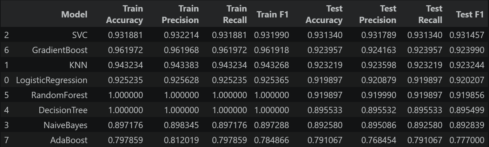
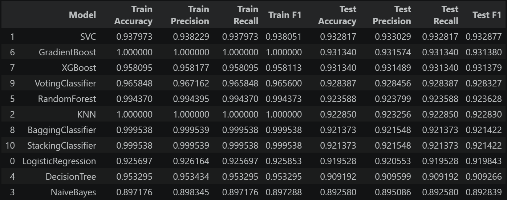
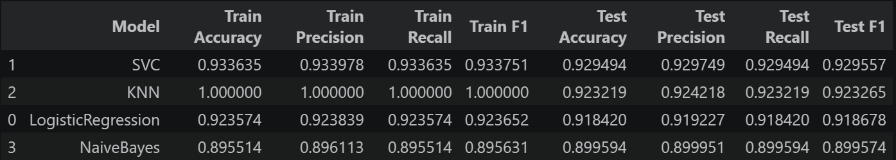
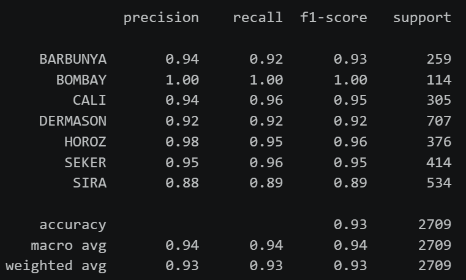
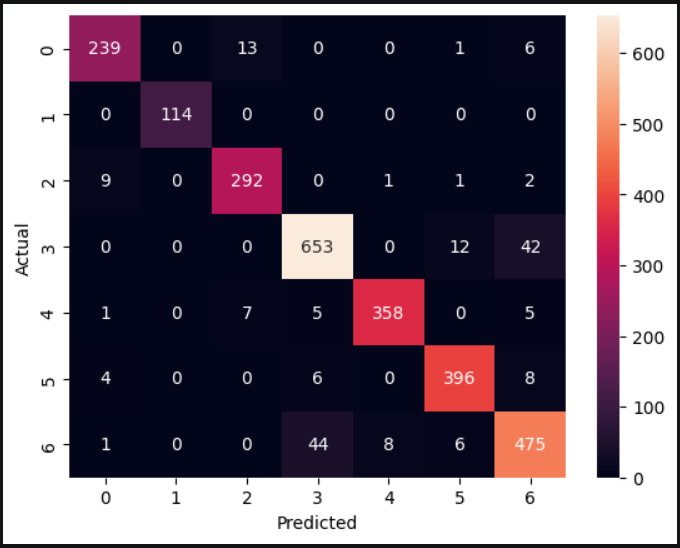

# 🫘 Dry Bean Classification using Machine Learning

[](https://beans-multiclass-classification-prediction.streamlit.app/)

---

## 📌 Project Overview

This project classifies **7 different varieties of dry beans** using their **morphological features** extracted from images.

The objective is to build a **high-performance multiclass classification model** using a structured machine learning pipeline, including baseline modeling, preprocessing, dimensionality reduction, hyperparameter tuning, and deployment.

---

# 🎯 Problem Statement

To build a **machine learning model** that predicts the **type of dry bean** based on its geometric and shape-based features.

---

# 📊 Dataset

- **Total Samples:** 13,611  
- **Features:** 16 numerical features  
- **Target Classes (7):**  
  `SEKER, BARBUNYA, BOMBAY, CALI, HOROZ, SIRA, DERMASON`

---

# 📐 Features

- area  
- perimeter  
- major_axis_length  
- minor_axis_length  
- aspect_ratio  
- eccentricity  
- convex_area  
- equiv_diameter  
- extent  
- solidity  
- roundness  
- compactness  
- shape_factor_1  
- shape_factor_2  
- shape_factor_3  
- shape_factor_4  

---

# 🔎 Exploratory Data Analysis (EDA)

- Feature distribution analysis  
- Correlation analysis  
- Identified strong feature correlations  

---


# 🤖 Baseline Models

Initially, models were trained **without preprocessing or tuning** to establish a performance benchmark.

### Models Used:
- Logistic Regression  
- KNN  
- SVM  
- Naive Bayes
- DecisionTree
- RandomForest
- GradientBoost
- AdaBoost 

### 📊 Baseline Performance



---

# ⚙️ Preprocessed + Tuned Models

Applied:
- Feature scaling (StandardScaler)  
- Hyperparameter tuning (GridSearchCV)  

### 📊 Model Performance



---

# 🔬 PCA + Preprocessing + Hyperparameter Tuning

To address multicollinearity:

- Applied **PCA for dimensionality reduction**  
- Combined with scaling and tuning  

### 📊 Model Performance



---

# 🏆 Final Model Selection

After comparing all approaches:

### ✅ **Support Vector Machine (SVM)**

- Kernel: RBF  
- C: 10  
- Selected based on **highest F1 Score and stability**

---

# 📊 Final Model Evaluation

### Classification Report



---

### Confusion Matrix



---

# 💻 Streamlit Web Application

An interactive **Streamlit application** was built for real-time predictions.

### Features:
- Modern UI with custom styling  
- Input form for all 16 features  
- Real-time prediction  
- Visual output display  

---

### ▶️ Run Locally

```bash
pip install -r requirements.txt
```

### Run the Application

```bash
streamlit run app.py
```

---

# 🛠 Technologies Used

* Python
* Pandas
* NumPy
* Matplotlib
* Seaborn
* Scikit-learn
* XGBoost
* Streamlit

---

# 📂 Project Structure

```
beans_multiclass_classification_Prediction/

├── Beans_Multiclass_Classification.csv
├── code.ipynb
├── images/
│   ├── baseline_metrics.png
│   ├── PCA_preprocessed_tuned_models_metrics.png
│   ├── preprocessed_tuned_models_metrics.png
│   ├── final_model_classification_report.png
│   ├── final_model_confusion_metrics.png
├── .gitignore
├── model.pkl
├── app.py
├── requirements.txt
└── README.md
```

---

# 📚 Key Learnings

* End-to-end machine learning workflow
* Data preprocessing and feature engineering and Class Imbalance
* PCA
* Hyperparameter tuning with GridSearchCV
* Deploying ML models with Streamlit

---

# 👨‍💻 Author

**Sagar S**
Data Science Enthusiast
