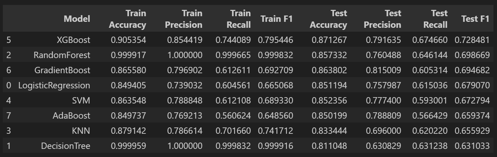
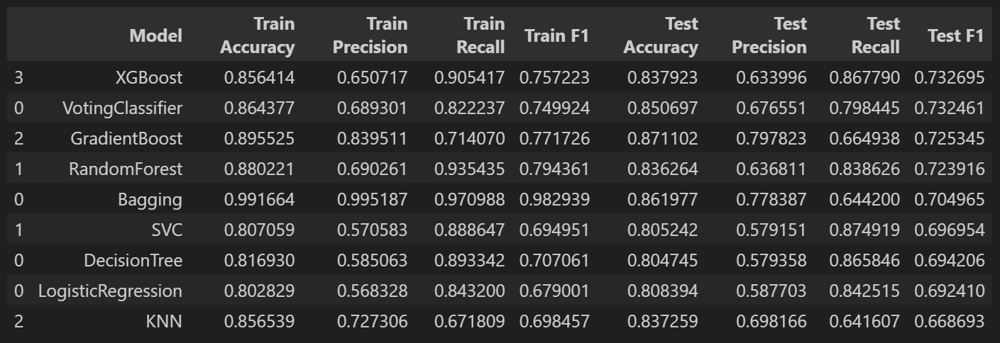
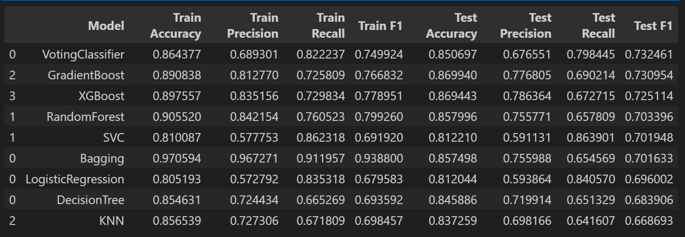

# 💼 Income Classification using Machine Learning

[](YOUR_STREAMLIT_LINK_HERE)

## 📌 Project Overview
This project predicts whether an individual earns **more than $50K or less than or equal to $50K per year** using demographic and employment-related attributes.

The goal is to build a **robust classification model** that can handle **class imbalance** and accurately identify high-income individuals.

This project follows a **complete end-to-end machine learning workflow**, including baseline modeling, preprocessing, imbalance handling (SMOTE & class weighting), hyperparameter tuning, cross-validation, and final model selection.

---

# 🎯 Problem Statement
To build a **machine learning classification model** that predicts whether an individual earns **>50K or <=50K** using demographic and employment-related features.

---

# 📊 Dataset

The dataset contains demographic and employment-related information of individuals.

### Target Variable
- **Income (<=50K, >50K)**

### Features

- age
- workclass
- fnlwgt
- education
- education-num
- marital-status
- occupation
- relationship
- race
- sex
- capital-gain
- capital-loss
- hours-per-week
- native-country

---

# 📚 Data Dictionary

| Column         | Description                                                    |
| -------------- | -------------------------------------------------------------- |
| age            | Age of the individual                                          |
| workclass      | Type of employment                                             |
| fnlwgt         | Final sampling weight (population representation)              |
| education      | Highest level of education attained                            |
| education-num  | Numeric representation of education level                      |
| marital-status | Marital status of the individual                               |
| occupation     | Type of job                                                    |
| relationship   | Relationship within household                                  |
| race           | Race category                                                  |
| sex            | Gender                                                         |
| capital-gain   | Capital gains earned                                           |
| capital-loss   | Capital losses incurred                                        |
| hours-per-week | Hours worked per week                                          |
| native-country | Country of origin                                              |
| income         | Target variable (**>50K or <=50K**)                            |

---

# 🔎 Exploratory Data Analysis (EDA)

EDA was performed to understand data patterns and imbalance.

Steps performed:

- Missing value analysis
- Class imbalance analysis
- Univariate & bivariate analysis
- Feature distribution analysis

---

# 🤖 Baseline Models

Initially, multiple models were trained **without imbalance handling** to establish baseline performance.

Models tested:

- Logistic Regression
- Decision Tree
- Random Forest
- KNN
- SVM
- AdaBoost
- Gradient Boosting
- XGBoost

### 📊 Baseline Model Performance



---

# ⚙️ Improved Model Pipeline

### Preprocessing + Hyperparameter Tuning + Imbalance Handling

After baseline evaluation, performance was improved using advanced techniques.

### Data Preprocessing

- Handling missing values
- Encoding categorical variables
- Feature scaling (where required)
- Pipeline implementation

---

### Imbalance Handling Techniques

- **SMOTE (Synthetic Minority Oversampling)**
- **Class Weighting**

---

### Hyperparameter Tuning

- Performed using **GridSearchCV**
- Optimized models for **F1-score**

---

### 📊 Model Performance (Class Weight + Tuning)



---

### 📊 Model Performance (SMOTE + Tuning)



---


# 🏆 Final Model

After evaluating all approaches, the best model selected is:

### ✅ **XGBoost with scale_pos_weight (Class Weight approach)**

### 📊 Performance:
- **F1 Score:** ~0.73  
- **Recall (Minority Class):** ~0.86  
- Strong ability to detect high-income individuals  

---

### 📊 Classification Report & Confusion Matrix


---

# 💻 Streamlit Web Application

A **Streamlit web application** was developed to allow users to interactively predict life expectancy by entering input features.

```bash
pip install -r requirements.txt
```

### Run the Application

```bash
streamlit run life_expectancy_app.py
```

---

# 🛠 Technologies Used

* Python
* Pandas
* NumPy
* Matplotlib
* Seaborn
* Scikit-learn
* XGBoost
* Streamlit

---

# 📂 Project Structure

life_expectancy_prediction

- income_evaluation.csv

- code.ipynb

- images/
    baseline_metrics.png
    final_model_classification_report.png
    model_metrics_with_class_weight.png
    model_metrics_with_SMOTE_and_tuned.png

- .gitignore

- final_best_model.pkl

- app.py

- requirements.txt

- README.md

---

# 📚 Key Learnings

* End-to-end machine learning workflow
* Data preprocessing and feature engineering and Class Imbalance
* Hyperparameter tuning with GridSearchCV
* Model evaluation using cross-validation
* Ensemble learning techniques
* Deploying ML models with Streamlit

---

# 👨‍💻 Author

**Sagar S**
Data Science Enthusiast