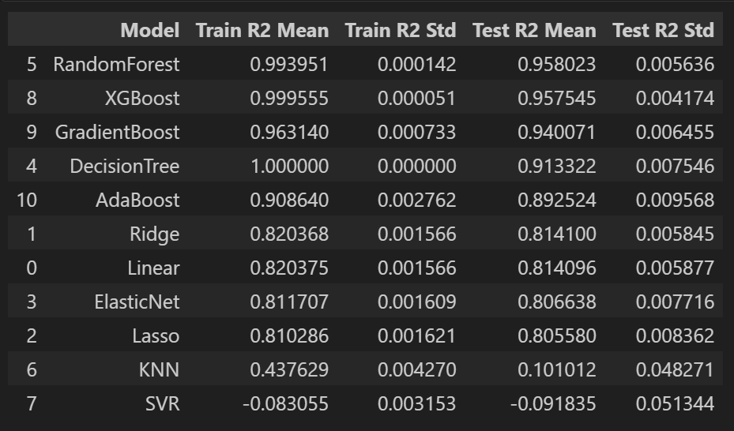
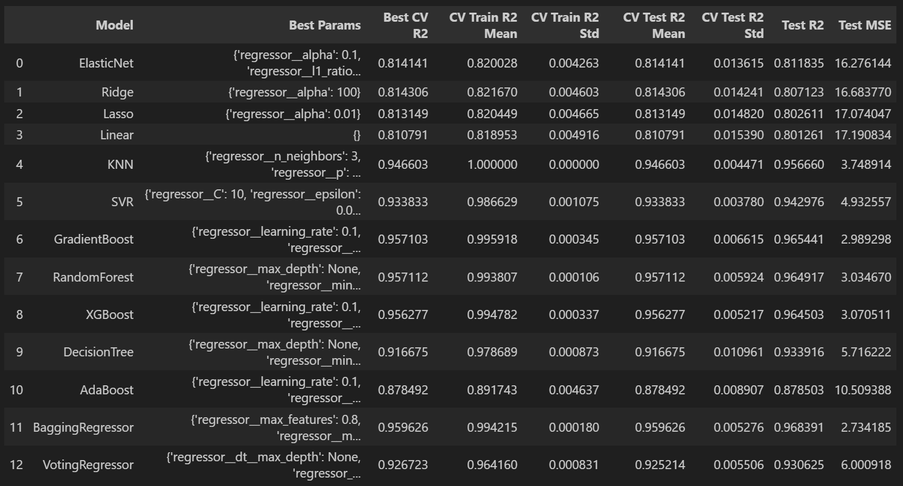
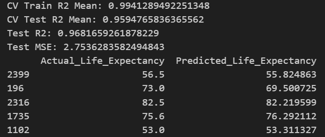

# 🌍 Life Expectancy Prediction using Machine Learning

[](https://ml-portfolio-beocuuhnzkgmmrq7xrab93.streamlit.app/)

## 📌 Project Overview
This project predicts the **life expectancy of a country** using health, economic, and demographic indicators.

The goal is to build a **machine learning regression model** that can accurately estimate life expectancy based on historical data.

This project follows a **complete end-to-end machine learning workflow**, including baseline modeling, preprocessing, hyperparameter tuning, cross-validation, and final model selection.

---

# 🎯 Problem Statement
To build a **machine learning model that predicts life expectancy** of a country using healthcare, economic, and demographic factors.

---

# 📊 Dataset
The dataset contains information about multiple countries over several years.

### Target Variable
- **Life expectancy**

### Features

- Country
- Year
- Status
- Adult Mortality
- infant deaths
- Alcohol
- percentage expenditure
- Hepatitis B
- Measles
- BMI
- under-five deaths
- Polio
- Total expenditure
- Diphtheria
- HIV/AIDS
- GDP
- Population
- Schooling

---

# 📚 Data Dictionary

| Column | Description |
|------|-------------|
| Country | Name of the country |
| Year | Year of the record |
| Status | Developed or Developing country |
| Life expectancy | Average life expectancy in years |
| Adult Mortality | Probability of dying between ages 15 and 60 |
| infant deaths | Infant deaths per 1000 population |
| Alcohol | Alcohol consumption per capita |
| percentage expenditure | Health expenditure as % of GDP |
| Hepatitis B | Hepatitis B immunization coverage (%) |
| Measles | Number of measles cases |
| BMI | Average Body Mass Index |
| under-five deaths | Deaths under age five |
| Polio | Polio vaccination coverage |
| Total expenditure | Government health expenditure |
| Diphtheria | Immunization coverage (%) |
| HIV/AIDS | Deaths due to HIV/AIDS |
| GDP | Gross Domestic Product |
| Population | Population of the country |
| Schooling | Average years of schooling |

---

# 🔎 Exploratory Data Analysis (EDA)

EDA was performed to understand the dataset and identify patterns.

Steps performed:

- Checking missing values
- Univariate analysis
- Bivariate analysis
- Outlier detection
- Skewness Checking

---

# 🤖 Baseline Models

Initially, several baseline machine learning models were trained **without heavy preprocessing** to understand the performance of different algorithms.

Models tested:

- Linear Regression
- Ridge
- Lasso
- Elastic net
- SVR
- KNN
- Decision Tree Regressor
- Random Forest Regressor
- Gradient Boosting Regressor
- AdaBoost Regressor
- XGBoost Regressor

### 📊 Baseline Model Performance



---

# ⚙️ Improved Model Pipeline

### Preprocessing + Hyperparameter Tuning + Cross Validation

After evaluating baseline models, the following improvements were applied to enhance model performance.

### Data Preprocessing

* Handling missing values
* Skewness Treatment
* Feature scaling where required
* Train-test split

### Hyperparameter Tuning

Hyperparameters were optimized using **GridSearchCV** to find the best model configuration.

### Cross Validation

To ensure model stability and generalization, **cross-validation** was applied during model evaluation.

### 📊 Model Performance After Improvements



---

# 🏆 Final Model

After comparing all models, the **Bagging Regressor** achieved the **highest accuracy and best generalization performance**.



# 💻 Streamlit Web Application

A **Streamlit web application** was developed to allow users to interactively predict life expectancy by entering input features.

```bash
pip install -r requirements1.txt
```

### Run the Application

```bash
streamlit run life_expectancy_app.py
```

---

# 🛠 Technologies Used

* Python
* Pandas
* NumPy
* Matplotlib
* Seaborn
* Scikit-learn
* XGBoost
* Streamlit

---

# 📂 Project Structure

life_expectancy_prediction

- Life Expectancy Data.csv

- code.ipynb

- images/
    Bagging_Regressor_Metrics.png
    baseline_model_metrics.png
    Hyper_parameter_metrics.png

- .gitignore

- life_expectancy_pipeline.pkl

- model_comparison_results.csv

- life_expectancy_app.py

- requirements.txt

- requirements1.txt

- README.md

---

# 📚 Key Learnings

* End-to-end machine learning workflow
* Data preprocessing and feature engineering
* Hyperparameter tuning with GridSearchCV
* Model evaluation using cross-validation
* Ensemble learning techniques
* Deploying ML models with Streamlit

---

# 👨‍💻 Author

**Sagar S**
Data Science Enthusiast
