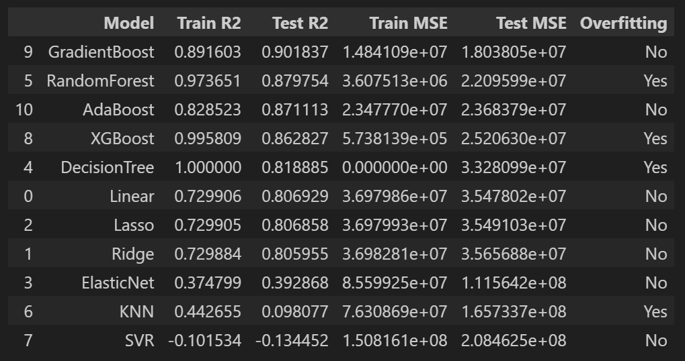
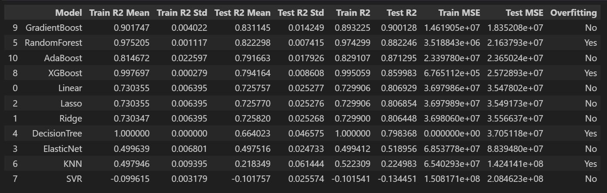
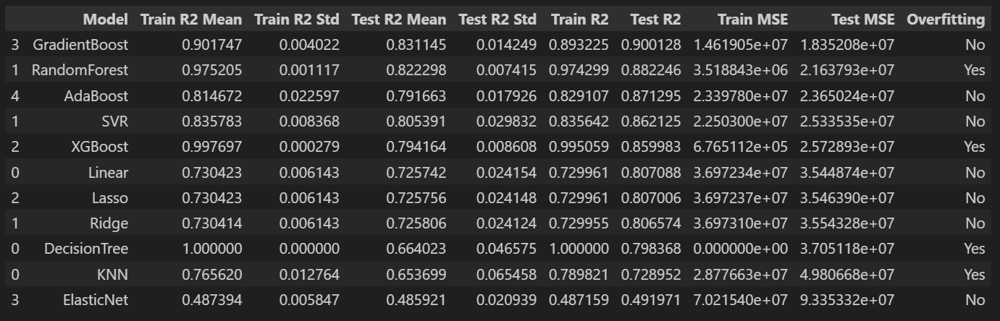
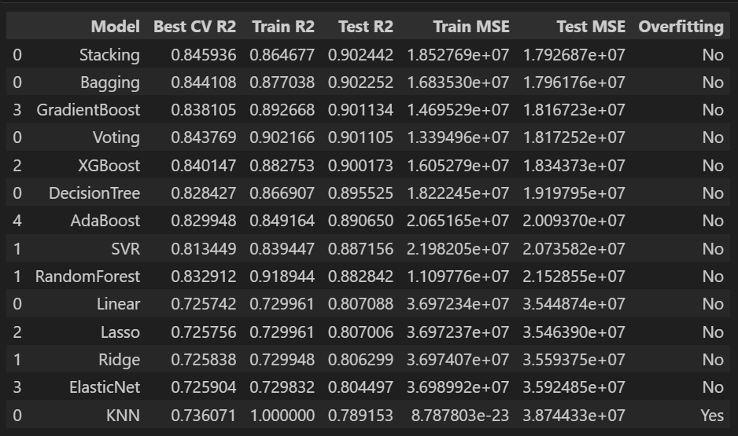
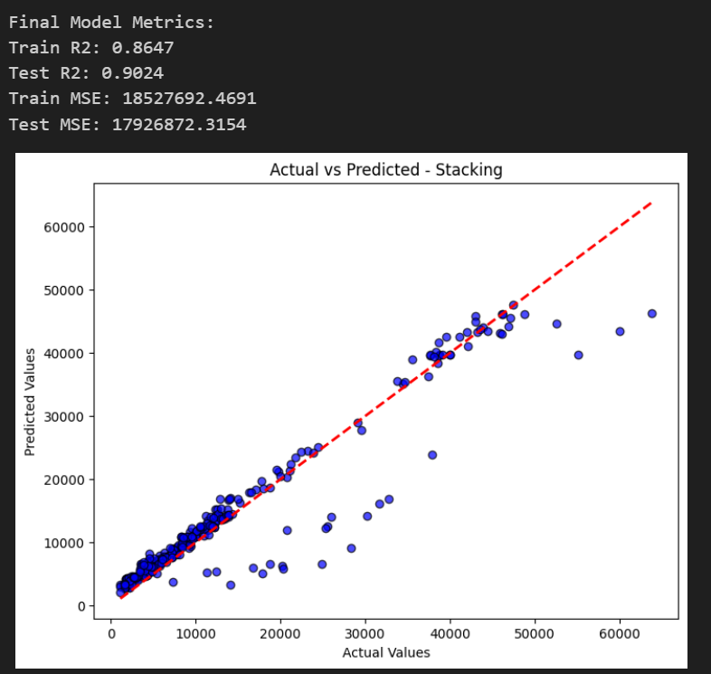
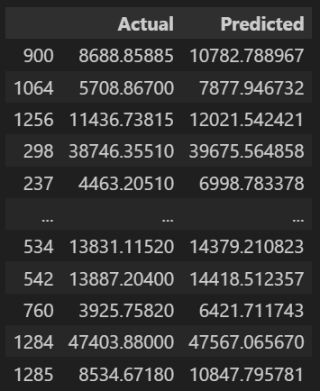
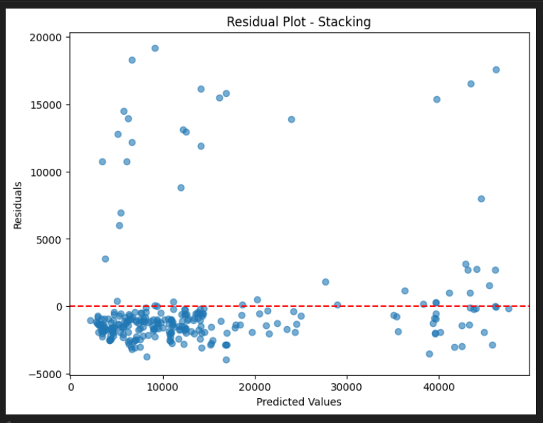

# 💼 Medical Insurance Cost Prediction using Machine Learning

[](https://ml-portfolio-cwvrenatficqifujsykozr.streamlit.app/)

---

# 📌 Project Overview

This project predicts **medical insurance costs (charges)** based on individual attributes such as age, BMI, smoking habits, and region.

The objective is to build a **robust regression model** that can accurately estimate insurance charges while handling:

- Skewed data distributions  
- Outliers  
- Different feature types  
- Model generalization  

This project follows a **complete end-to-end machine learning workflow**, including preprocessing, multiple model training, hyperparameter tuning, ensemble learning, and final evaluation.

---

# 🎯 Problem Statement

To build a **machine learning regression model** that predicts **medical insurance charges** based on demographic and lifestyle-related features.

---

# 📊 Dataset

The dataset contains personal and health-related information of individuals.

### 🎯 Target Variable
- **Charges (Medical Insurance Cost)**

### 📌 Features

- age  
- sex  
- bmi  
- children  
- smoker  
- region  

---

# 📚 Data Dictionary

| Column   | Description                                  |
|----------|----------------------------------------------|
| age      | Age of the individual                        |
| sex      | Gender                                       |
| bmi      | Body Mass Index                              |
| children | Number of dependents                         |
| smoker   | Smoking status (Yes/No)                      |
| region   | Residential region                           |
| charges  | Medical insurance cost (Target variable)     |

---

# 🔎 Exploratory Data Analysis (EDA)

EDA was performed to understand distributions, relationships, and outliers.

### Key Steps:

- Missing value check  
- Duplicate handling  
- Univariate analysis (distribution plots)  
- Bivariate analysis (feature vs target) 
- Correlation analysis
- skewness analysis

---

# 🤖 Baseline Models

Multiple models were trained **without preprocessing** to establish baseline performance.

### Models Tested:

- Linear Regression  
- Ridge Regression  
- Lasso Regression
- Elastic Net  
- KNN Regressor  
- Decision Tree  
- Random Forest  
- Gradient Boosting  
- AdaBoost
- XGBoost  
- SVR  

---

### 📊 Baseline Model Performance



---

### 📊 Baseline with Cross Validation



---

# ⚙️ Improved Model Pipeline

After baseline evaluation, models were improved using structured pipelines.

---

## 🔧 Data Preprocessing

- Handling skewed numerical features using **PowerTransformer (Yeo-Johnson)**  
- Feature scaling for distance-based models  
- OneHotEncoding for categorical features  
- ColumnTransformer for structured preprocessing  
- Pipeline integration for clean workflow  

---

### 📊 Preprocessed Models Performance



---

# 🚀 Hyperparameter Tuning

Models were optimized using:

- **GridSearchCV**
- Cross-validation (5-fold)

Goal:
- Improve generalization  
- Reduce overfitting  
- Optimize model performance  

---

### 📊 Preprocessed + Tuned Models



---

# 🧠 Ensemble Learning

To further improve performance, ensemble techniques were applied:

- **Voting Regressor**
- **Bagging Regressor**
- **Stacking Regressor**

👉 Stacking model combines predictions of multiple models to achieve better accuracy.

---

# 🏆 Final Model

### ✅ **Stacking Regressor (Best Performing Model)**

---

### 📊 Final Model Performance



---

### 📊 Actual vs Predicted



---

### 📊 Residual Analysis



---

# 💻 Streamlit Web Application

A **Streamlit web app** was built to allow users to predict medical insurance costs interactively.

### Install Requirements

```bash
pip install -r requirements.txt
```

### Run the Application

```bash
streamlit run life_expectancy_app.py
```

---

# 🛠 Technologies Used

* Python
* Pandas
* NumPy
* Matplotlib
* Seaborn
* Scikit-learn
* XGBoost
* Streamlit

---

# 📂 Project Structure

```
Medical_Insurance_Cost_Prediction/

├── Medical_Insurance_cost_prediction.csv
├── code.ipynb
├── images/
│   ├── simple_baseline_models_metrics.png
│   ├── baseline_models_metrics_with_cross_validation.png
│   ├── preprocessed_only_models_metrics.png
│   ├── preprocessed_and_tuned_models_metrics.png
│   ├── final_model_actual_vs_predicted_dataframe.png
│   ├── final_model_metrics.png
│   ├── final_model_residual_plot.png
├── .gitignore
├── model.pkl
├── app.py
├── requirements.txt
└── README.md
```


---

# 📚 Key Learnings

* End-to-end machine learning workflow
* Data preprocessing and feature engineering
* Hyperparameter tuning with GridSearchCV
* Model evaluation using cross-validation
* Ensemble learning techniques
* Deploying ML models with Streamlit

---

# 👨‍💻 Author

**Sagar S**
Data Science Enthusiast
